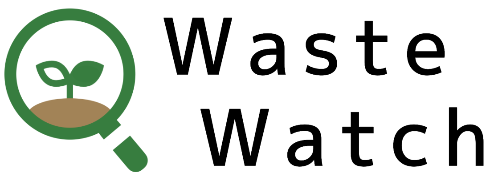

# 廃棄物マップ WasteWatch

<a href="https://waste-watch.vercel.app/"   target="_blank" rel="noopener noreferrer" aline="center">

</a>

[https://waste-watch.vercel.app/](https://waste-watch.vercel.app/)

## 概要

ゴミの最終処分場の寿命はあと 20 年ということをご存知でしょうか。  
環境省は「およそ 2040 年で日本全国のゴミの埋立地である、最終処分場が満杯になる」という発表を出しています。

ごみマップ WasteWatch は、都道府県それぞれの廃棄物の特色と最終処分場の状況を可視化し、廃棄物の分析を行えるサービスです。

## WasteWatch の使い方

- **廃棄物の情報の特性を把握する**
  - 色分けされた分布により、日本各地の地域特性を把握することができます
- **県ごとの廃棄物特性を確認する**
  - 都道府県をクリックすると、その県のごみ割合・ランキングを確認できます
- **最終処分場の情報を確認する**
  - 各自治体の最終処分場の埋め立て状況、対象廃棄物情報を確認できます

## 技術スタック

- [NextJS](https://nextjs.org/) フロント画面
- [leaflet](https://leafletjs.com/) マップ表示
- [recharts](https://recharts.org/en-US/) グラフ表示

## データリンク

[日本の廃棄物処理（令和 4 年 4 月 20 日現在）](https://www.env.go.jp/recycle/waste_tech/ippan/r2/index.html)

[47 都道府県のポリゴンデータ geojson](https://japonyol.net/editor/article/47-prefectures-geojson.html)
